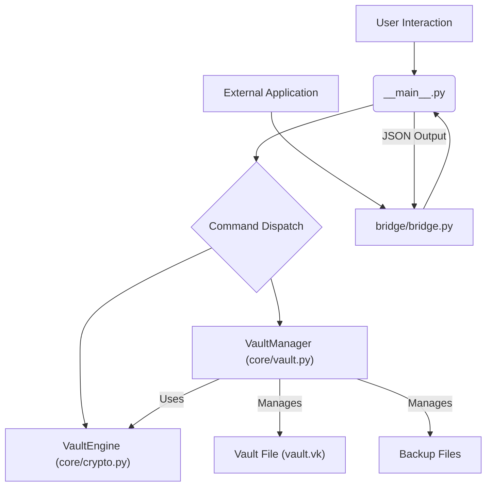

# VOKUL-CLI: Comprehensive Documentation

This document provides an in-depth look into the VOKUL-CLI password manager, covering its architecture, command-line interface, internal mechanisms, and integration points.

## Table of Contents

1.  [Introduction](#1-introduction)
2.  [Architecture Overview](#2-architecture-overview)
3.  [Installation and Setup](#3-installation-and-setup)
4.  [Command-Line Interface (CLI)](#4-command-line-interface-cli)
    *   [Global Options](#global-options)
    *   [`vokul init`](#vokul-init)
    *   [`vokul add`](#vokul-add)
    *   [`vokul edit`](#vokul-edit)
    *   [`vokul get`](#vokul-get)
    *   [`vokul list`](#vokul-list)
    *   [`vokul search`](#vokul-search)
    *   [`vokul history`](#vokul-history)
    *   [`vokul totp`](#vokul-totp)
    *   [`vokul generate`](#vokul-generate)
    *   [`vokul delete`](#vokul-delete)
    *   [`vokul destruct`](#vokul-destruct)
    *   [`vokul check`](#vokul-check)
    *   [`vokul version`](#vokul-version)
5.  [Security and Cryptography](#5-security-and-cryptography)
    *   [Key Derivation](#key-derivation)
    *   [Encryption](#encryption)
    *   [Throttling Mechanism](#throttling-mechanism)
6.  [Vault Management and Data Structure](#6-vault-management-and-data-structure)
    *   [Vault File Format](#vault-file-format)
    *   [Backup and Recovery](#backup-and-recovery)
    *   [Password History](#password-history)
7.  [JSON Output for Integration](#7-json-output-for-integration)
8.  [Native Messaging Bridge (`bridge.py`)](#8-native-messaging-bridge-bridge.py)
9.  [Error Handling](#9-error-handling)
10. [Development and Contribution](#10-development-and-contribution)
11. [License](#11-license)

---

## 1. Introduction

VOKUL-CLI is a secure, local-first command-line password manager written in Python. It prioritizes user control and data privacy by storing all sensitive information encrypted on the user's local filesystem. This document serves as a comprehensive guide for developers, power users, and anyone interested in understanding the inner workings of VOKUL.

## 2. Architecture Overview

VOKUL-CLI follows a modular architecture, separating concerns into distinct components:

*   **`__main__.py`**: The primary entry point for the CLI. It handles argument parsing, command dispatching, and user interaction via the `rich` library for rich terminal output.
*   **`core/`**: Contains the core logic for cryptography and vault management.
    *   **`core/crypto.py`**: Implements cryptographic operations, including key derivation using Argon2id and data encryption/decryption using AES-GCM.
    *   **`core/vault.py`**: Manages the vault's lifecycle, including creation, loading, saving, backup, recovery, and CRUD operations for secrets.
    *   **`core/params.py`**: Defines cryptographic parameters for key derivation.
    *   **`core/exceptions.py`**: Custom exception classes for VOKUL-specific errors.
*   **`bridge/bridge.py`**: An optional native messaging host that allows external applications (e.g., browser extensions) to interact with the VOKUL-CLI in a structured JSON format.
*   **`public/`**: Contains branding assets like logos and banners.



## 3. Installation and Setup

### Prerequisites

Ensure you have Python 3.8 or a newer version installed on your system.

### Installation via pip

The recommended way to install VOKUL-CLI is through pip:

```bash
pip install vokul
```

This will install the `vokul` command globally on your system.

### Installation from Source

For development or to use the latest unreleased features, you can install from source:

1.  **Clone the repository:**
    ```bash
    git clone https://github.com/your-repo/vokul-cli.git
    cd vokul-cli
    ```
2.  **Install in editable mode:**
    ```bash
    pip install -e .
    ```
    This command installs the project in 
editable mode, meaning any changes you make to the source code will be immediately reflected when you run `vokul`.

## 4. Command-Line Interface (CLI)

VOKUL-CLI provides a rich set of commands for managing your password vault. All commands are accessed via the `vokul` executable.

### Global Options

*   `--vault <path>`: Specifies the path to the vault file. Defaults to `vault.vk` in the current directory.
*   `--json`: Outputs results in JSON format, suppressing the rich terminal user interface (TUI). Useful for scripting and integrations.

### `vokul init`

Initializes a new, empty vault at the specified `--vault` path. If a vault already exists at the path, it will prevent initialization.

```bash
vokul init
```

**Prompts:** Master Password, Confirm Master Password.

### `vokul add`

Adds a new service entry to the vault. If the service already exists, it will update the entry.

*   `--service <name>` (Required): The name of the service (e.g., `github`, `mybank`).
*   `--password <password>` (Optional): The password for the service. If not provided, you will be prompted securely.
*   `--totp <secret>` (Optional): The TOTP secret key for 2FA. If not provided, you will be prompted (can be left blank).

```bash
vokul add --service github
vokul add --service mybank --password "StrongP@ssw0rd!" --totp "JBSWY3DPEHPK3PXP"
```

### `vokul edit`

Edits an existing service entry in the vault. Similar to `add`, but specifically for modifying existing entries.

*   `--service <name>` (Required): The name of the service to edit.
*   `--password <new_password>` (Optional): The new password for the service. If not provided, you will be prompted securely.
*   `--totp <new_secret>` (Optional): The new TOTP secret key. If not provided, you will be prompted (can be left blank).

```bash
vokul edit --service github --password "NewSecureP@ss"
vokul edit --service mybank --totp "NEWTOTPSECRET"
```

### `vokul get`

Retrieves the password and/or TOTP code for a specified service. By default, the password is copied to the clipboard and cleared after 15 seconds for security.

*   `--service <name>` (Required): The name of the service to retrieve.
*   `--show` (Optional): Prints the password directly to the terminal instead of copying to the clipboard. Use with caution in secure environments.

```bash
vokul get --service github
vokul get --service mybank --show
```

### `vokul list`

Lists all service names currently stored in the vault, indicating whether each has an associated TOTP configuration.

```bash
vokul list
```

### `vokul search`

Searches for service names that match a given query string (case-insensitive).

*   `<query>` (Required): The search term.

```bash
vokul search git
```

### `vokul history`

Displays the password history for a specific service. VOKUL stores the last few password changes.

*   `--service <name>` (Required): The name of the service.

```bash
vokul history github
```

### `vokul totp`

Generates and displays the current Time-based One-Time Password (TOTP) for a service, if a TOTP secret is configured.

*   `--service <name>` (Required): The name of the service.

```bash
vokul totp mybank
```

### `vokul generate`

Generates a new strong password based on specified criteria.

*   `--length <int>` (Optional): The desired length of the generated password. Defaults to 16.
*   `--no-symbols` (Optional): Excludes symbols from the generated password.
*   `--memorable` (Optional): Generates a phrase-based memorable password instead of a random string.

```bash
vokul generate --length 24
vokul generate --memorable
vokul generate --no-symbols
```

### `vokul delete`

Deletes a service entry from the vault. Requires user confirmation in interactive mode.

*   `--service <name>` (Required): The name of the service to delete.

```bash
vokul delete oldservice
```

### `vokul destruct`

Permanently deletes the entire vault file. This action is irreversible and requires explicit confirmation or the `--force` flag.

*   `--force` (Optional): Skips the confirmation prompt, immediately deleting the vault.

```bash
vokul destruct
vokul destruct --force
```

### `vokul check`

Checks if a vault file exists at the specified path and reports its accessibility.

```bash
vokul check
```

### `vokul version`

Displays the current version of VOKUL-CLI.

```bash
vokul version
```

## 5. Security and Cryptography

VOKUL employs industry-standard cryptographic practices to ensure the security of your vault data.

### Key Derivation

VOKUL uses **Argon2id** for key derivation from your master password. Argon2id is a hybrid version of Argon2, combining the best of Argon2d (resistant to GPU cracking attacks) and Argon2i (resistant to side-channel timing attacks). It is the recommended algorithm by the Password Hashing Competition.

**Parameters (`core/params.py`):**

*   `time_cost`: Number of iterations (default: 3)
*   `memory_cost`: Amount of memory to use (default: 65536 KiB = 64 MiB)
*   `parallelism`: Number of parallel threads (default: 4)
*   `salt_len`: Length of the salt (default: 16 bytes)
*   `key_len`: Length of the derived key (default: 32 bytes)

These parameters are designed to make key derivation computationally expensive, thus increasing resistance to brute-force attacks.

### Encryption

Vault data is encrypted using **AES-GCM (Advanced Encryption Standard in Galois/Counter Mode)**. AES-GCM is an authenticated encryption algorithm, meaning it provides both confidentiality (data privacy) and authenticity (data integrity and origin authentication). This prevents tampering with the encrypted data.

*   **Symmetric Key**: The key derived from your master password via Argon2id is used for both encryption and decryption.
*   **Nonce**: A unique, randomly generated **Nonce (Number Used Once)** is used for each encryption operation to ensure that identical plaintext does not produce identical ciphertext, enhancing security.
*   **Associated Data**: While not explicitly used for additional authenticated data in the current implementation, AES-GCM supports it for binding ciphertext to unencrypted data (e.g., headers) to prevent tampering of that data as well.

### Throttling Mechanism

VOKUL implements a persistent security throttling mechanism to protect against brute-force attacks across multiple CLI invocations. This mechanism works as follows:

1.  **Lock File**: A hidden lock file (`.vault.vk.lock`) is created alongside your vault file.
2.  **Failed Attempts Tracking**: Each failed master password attempt is recorded with a timestamp in this lock file.
3.  **Time Window**: Only failures within the last 5 minutes are considered.
4.  **Progressive Penalty**: If 3 or more failed attempts occur within the 5-minute window, a progressive time penalty is applied:
    *   Base penalty: 15 seconds.
    *   Additional penalty: 10 seconds for each failed attempt beyond 3.
5.  **Lockout**: During a lockout, VOKUL will intentionally stall its execution for the calculated penalty duration, making brute-force attacks impractical.
6.  **Clear on Success**: Upon successful authentication, the lock file is cleared.

This persistent throttling significantly enhances the security of your vault by making it extremely time-consuming to guess the master password.

## 6. Vault Management and Data Structure

### Vault File Format

The VOKUL vault file (`vault.vk` by default) is a JSON-formatted file containing the encrypted vault data. It stores the following top-level keys:

*   `salt`: The base64-encoded salt used for key derivation.
*   `nonce`: The base64-encoded nonce used for AES-GCM encryption.
*   `ciphertext`: The base64-encoded encrypted vault data (the actual secrets).

The `ciphertext` decrypts to a JSON object where keys are service names and values are objects containing password history (`pass` as a list) and TOTP secret (`totp`).

Example (decrypted structure):

```json
{
  "github": {
    "pass": [
      "myGitHubPassword123",
      "oldGitHubPassword",
      "olderGitHubPassword"
    ],
    "totp": null
  },
  "mybank": {
    "pass": [
      "MyBankSecurePass!"
    ],
    "totp": "JBSWY3DPEHPK3PXP"
  }
}
```

### Backup and Recovery

VOKUL implements an automatic backup and recovery mechanism to protect against data loss due to file corruption or accidental deletion:

1.  **Automatic Backups**: Before every save operation, the current vault file is backed up to a `backups/` subdirectory (e.g., `vault.vk.bak_YYYYMMDD_HHMMSS`).
2.  **Self-Healing**: If the main vault file is missing or corrupted during loading, VOKUL will automatically attempt to recover from the latest valid backup. It iterates through backups in reverse chronological order until a decryptable backup is found.
3.  **User Notification**: If a recovery occurs, the user is notified via a warning message in the terminal.

This ensures a high degree of resilience for your stored credentials.

### Password History

For each service, VOKUL maintains a history of the last three passwords used. This allows users to revert to a previous password if needed or to review past credentials. The current password is always at index 0 of the `pass` list.

## 7. JSON Output for Integration

VOKUL-CLI supports a `--json` global option that forces all command outputs to be in JSON format. This is particularly useful for integrating VOKUL with other tools, scripts, or applications that require machine-readable output rather than the human-friendly rich terminal interface.

**Example JSON Output:**

*   `vokul version --json`:
    ```json
    {"version": "1.0.0", "api_ready": true}
    ```
*   `vokul get --service github --json`:
    ```json
    {"service": "github", "password": "myGitHubPassword123"}
    ```
*   `vokul list --json`:
    ```json
    {"services": ["github", "mybank"]}
    ```

## 8. Native Messaging Bridge (`bridge.py`)

The `bridge/bridge.py` script acts as a native messaging host, enabling seamless communication between VOKUL-CLI and external applications, such as browser extensions. It operates by:

1.  **Reading Length-Prefixed JSON**: It reads incoming messages from `stdin`, where each message is prefixed by a 4-byte little-endian integer indicating the message length, followed by the JSON payload.
2.  **Invoking VOKUL-CLI**: It parses the incoming JSON command (e.g., `{"command":"get","service":"github"}`) and executes the corresponding `vokul` CLI command with the `--json` flag using `subprocess.run`.
3.  **Sending Length-Prefixed JSON Response**: It captures the JSON output from the `vokul` command, prefixes it with its length, and writes it back to `stdout`.

This bridge allows external applications to programmatically interact with the VOKUL vault without needing to directly parse CLI output or manage complex command invocations.

## 9. Error Handling

VOKUL-CLI provides clear error messages to the user, both in its rich terminal output and in JSON format when `--json` is specified. Custom exception classes (`VaultError`, `VaultCryptoError`, `VaultStorageError`) are used internally to categorize and manage different types of errors.

Common errors include:

*   **Incorrect Master Password**: Handled with a persistent throttling mechanism.
*   **Vault Not Found**: Prompts the user to initialize a vault.
*   **Service Not Found**: Indicates that the requested service does not exist in the vault.
*   **Corrupted Vault**: Triggers the automatic backup recovery process.

## 10. Development and Contribution

Contributions to VOKUL-CLI are welcome! Please refer to the `CONTRIBUTING.md` file (to be created) for guidelines on how to contribute, set up your development environment, and submit changes.

## 11. License

VOKUL-CLI is open-source software licensed under the MIT License. See the `LICENSE` file (to be created) for full details.
